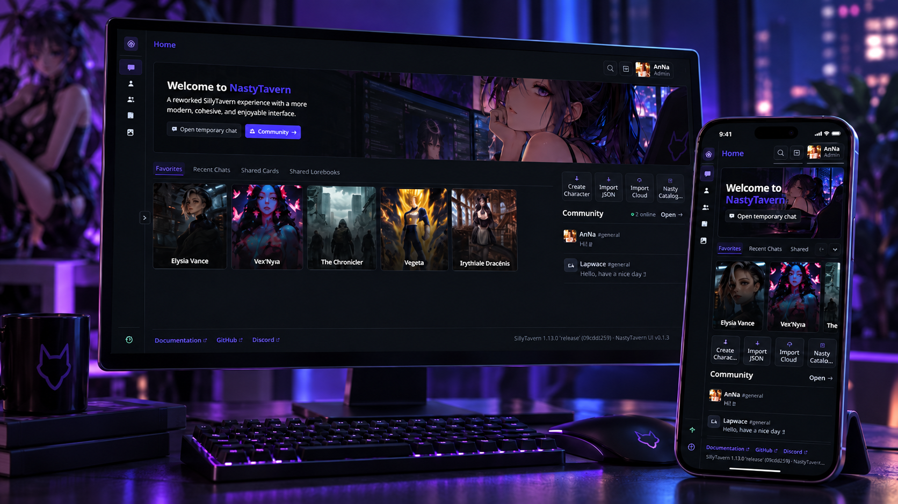
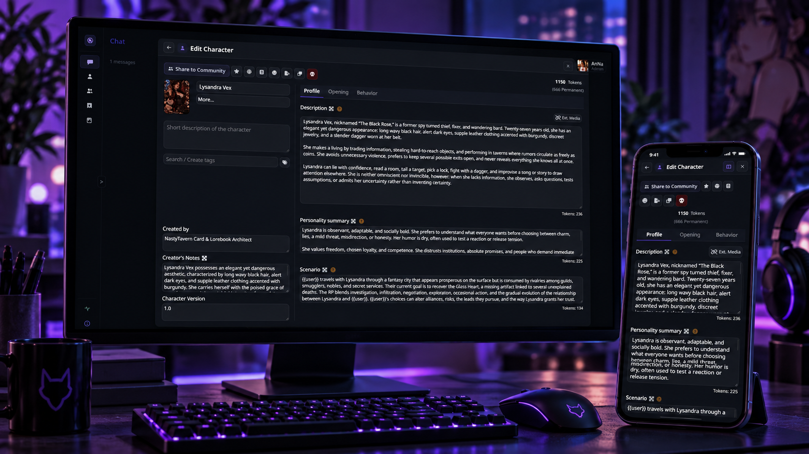
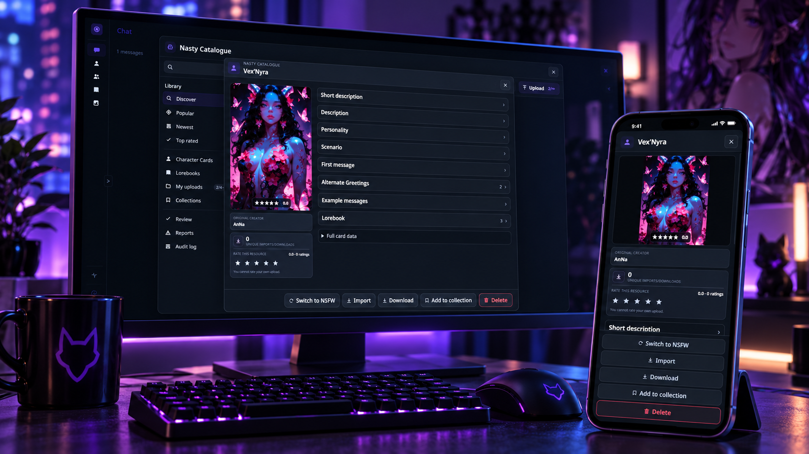
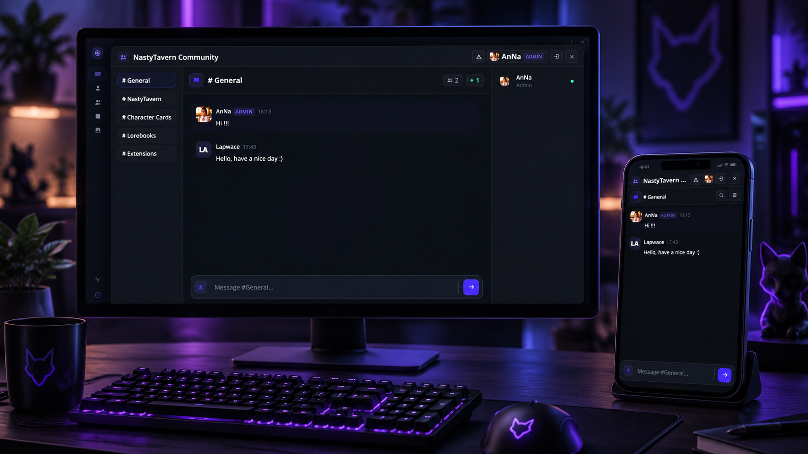
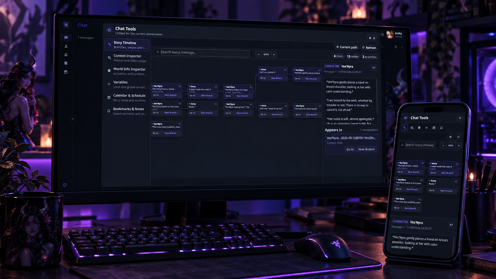
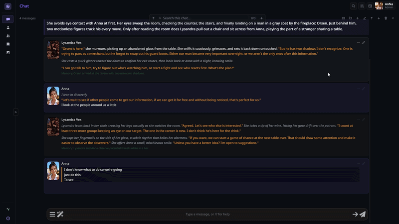
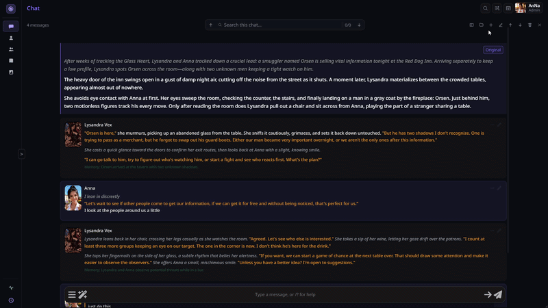

# NastyTavern UI

A complete modern UI/UX redesign for **SillyTavern 1.18+**.

NastyTavern transforms SillyTavern's visual design, navigation, layouts, panels, and everyday workflows into a more modern and cohesive interface.

The underlying SillyTavern features remain intact: chats, Character Cards, Personas, Lorebooks, models, prompts, APIs, extensions, and their data continue to rely on SillyTavern's existing systems.

On top of that, NastyTavern adds integrated tools, improved mobile support, Community features, and the Nasty Catalogue for discovering and sharing Character Cards and Lorebooks.

> **Current release version:** `0.1.9`
> **Minimum SillyTavern version:** `1.18.0`

## 📸 Screenshots

### 🏠 Home



### 🧑‍🎨 Character Editor



### 📚 Nasty Catalogue



### 🌐 Community



### 🧰 Chat Tools & Story Timeline



### 🎨 Global Chat Appearance

Configure the default presentation used across your chats from **NastyTavern Settings → Chat appearance**. User and Character styling can be customized independently, with dedicated controls for avatars, names, message surfaces, typography, spacing, rich content, code, links, lists, media, and more.



### 🎭 Individual Chat Appearance

Open **Chat appearance** from an active character chat to create presentation overrides for that character without changing the global defaults. Any setting left on **Inherit** continues to follow the global NastyTavern configuration, so only the properties you explicitly customize become character-specific.



---

## ✨ Highlights

- 🎨 **Modern interface** — cleaner navigation, redesigned panels, consistent styling, and easier access to SillyTavern's main features.
- 💬 **Nasty Chat Bar** — quickly switch chats, search messages, manage conversations, change connection profiles, and access useful tools.
- 🎛️ **Global & Individual Chat Appearance** — define a complete global chat presentation in NastyTavern Settings, then override only the properties you want for individual character chats. User and Character styling remain independent, while per-character values inherit the global configuration by default.
- 🧰 **Integrated tools** — Story Timeline, Context / Token Inspector, Variable Manager, World Info Inspector, Bookmarks, Notes, Calendar and Schedule.
- 🏠 **Home Dashboard** — recent characters, favorites, quick actions, Community activity, and resource discovery from one place.
- 📚 **Nasty Catalogue** — discover, rate, organize, download, and import Character Cards and Lorebooks shared by the Community.
- 🌐 **Community Chat** — chat with other NastyTavern users, share resources, react to messages, reply, search conversations, and create a Community profile.
- 🧑‍🎨 **Improved Character Management** — redesigned Character Library, cleaner editing, better navigation, Groups integration, and direct Catalogue access.
- 📖 **Improved Lorebook interface** — easier navigation and editing with layouts adapted for both desktop and mobile.
- 🧩 **Improved Extensions interface** — cleaner access to installed extensions and their settings.
- 📱 **Mobile support** — dedicated portrait and landscape layouts with touch-friendly controls.
- ⌨️ **Keyboard shortcuts** — configurable shortcuts for NastyTavern tools.
- ❤️ **Health & Performance** — built-in diagnostics to help identify interface or compatibility issues.
- 🌍 **Internationalization** — English and French support, with additional languages possible in the future.

---

# 📦 Installation

## SillyTavern extension installer

Open:

**Extensions → Install extension**

Then enter:

```text
https://github.com/AnNastyLoneGirl/NastyTavern-UI
```

Reload SillyTavern and enable **NastyTavern UI** if needed.

## Manual installation

Copy the entire `NastyTavern-UI` folder into your SillyTavern user extensions directory and reload SillyTavern.

NastyTavern UI requires **SillyTavern 1.18.0 or newer**.

---

# 📚 Nasty Catalogue

Introduced in **v0.1.3**, Nasty Catalogue is a permanent Community library for sharing Character Cards and Lorebooks.

You can:

- 🔎 Search for Character Cards and Lorebooks
- ⭐ Rate resources from 1 to 5 stars
- 🔥 Browse popular resources
- 🆕 Discover recently published resources
- 🏆 Find highly rated resources
- 🧑‍🎨 View creator pages
- 📥 Download resources
- ➕ Import resources directly into SillyTavern
- ❤️ Create collections
- 🌐 Share public collections with the Community
- 🔒 Keep personal collections private
- 🛡️ Report inappropriate resources
- 🔞 Filter SFW and NSFW content

Character Cards can also keep track of their original creator when modified versions are shared, making it easier to identify the original card and Community-made versions.

New resources go through moderation before appearing publicly in the Catalogue.

---

# 🌐 Community

NastyTavern includes an optional Community directly inside SillyTavern.

Community features include:

- Real-time chat
- Multiple Community channels
- Replies
- Reactions
- Message search
- Typing indicators
- Mentions
- Unread notifications
- User profiles
- Avatars and bios
- Character Card sharing
- Lorebook sharing
- Direct downloads
- Direct import into SillyTavern
- Reporting and moderation

You can create an account using **email/password** or **Google**.

---

# 🧑‍🎨 Character Management

NastyTavern reorganizes Character Management into a cleaner and more comfortable workspace.

Features include:

- Redesigned Character Library
- Character pagination
- Search, tags and sorting
- Favorites
- Improved character creation
- Improved character editing
- Better dialogue example editing
- Group management
- Character Card details
- Direct access to Nasty Catalogue
- Sharing and publishing tools

SillyTavern remains responsible for the actual Character Card data and behavior.

---

# 🎨 Chat Appearance

Chat Appearance is split into two complementary levels so you can keep a consistent base style without losing per-character control.

## Global Chat Appearance

The global editor in **NastyTavern Settings → Chat appearance** defines the default presentation for chats. User and Character each have their own controls, organized into **Avatar**, **Name**, **Message**, and **Rich content** sections. Settings can inherit SillyTavern's active theme where appropriate, making the editor an extension of the existing SillyTavern appearance system rather than a separate visual layer.

Use the global editor for the look you want most conversations to share: message geometry, spacing, typography, colors, dialogue styling, emphasis and narration, quoted lines, code, links, headings, lists, media, avatar presentation, and name styling.

## Individual Chat Appearance

Each character chat can override the global Chat Appearance configuration without duplicating the whole setup. By default, individual settings stay on **Inherit**, so changes made globally continue to propagate automatically. Only the values you deliberately customize become overrides for that character.

This makes it possible to give a specific character or conversation its own visual identity while keeping the rest of NastyTavern consistent. You can change a single detail or build a complete per-character presentation, then return any setting, category, or the full chat back to the inherited global state when needed.

---

# 📖 Lorebooks

The Lorebook interface has also been redesigned for easier navigation and editing.

It includes:

- Cleaner Lorebook selection
- Easier entry navigation
- Larger editing workspace
- Improved settings access
- Better mobile layouts
- Portrait and landscape support
- Community sharing
- Catalogue integration

---

# 📱 Mobile support

NastyTavern includes dedicated responsive layouts for phones.

Both **portrait** and **landscape** orientations are supported, with adaptations for:

- Navigation
- Chat
- Character Management
- Lorebooks
- Community
- Catalogue
- Notes
- Bookmarks
- Settings
- Modals and tools

---

# 🧩 Design principles

NastyTavern is designed around a few simple ideas:

1. **Redesign the interface, preserve the functionality.**  
   NastyTavern completely reworks SillyTavern's visual design, navigation, layouts, panels, and workflows while keeping SillyTavern's underlying features, data, and behavior intact.

2. **Make common actions easier.**  
   Frequently used tools should be quick to reach.

3. **Keep advanced features available.**  
   A cleaner and more modern interface should not mean fewer possibilities.

4. **Stay compatible with SillyTavern.**  
   NastyTavern builds on top of SillyTavern's existing systems rather than replacing its core functionality.

5. **Desktop and mobile both matter.**  
   The interface is designed for mouse, keyboard, and touch usage.

---

# ☕ Support the project

If you enjoy **NastyTavern UI** and want to support its development, you can buy me a coffee on Ko-fi. 🤍

Your support helps with testing, future features, Community infrastructure, and compatibility improvements.

👉 **[Buy me a coffee on Ko-fi](https://ko-fi.com/annastylonegirl)**

---

Release history and patch notes are maintained in **[CHANGELOG.md](CHANGELOG.md)**.
